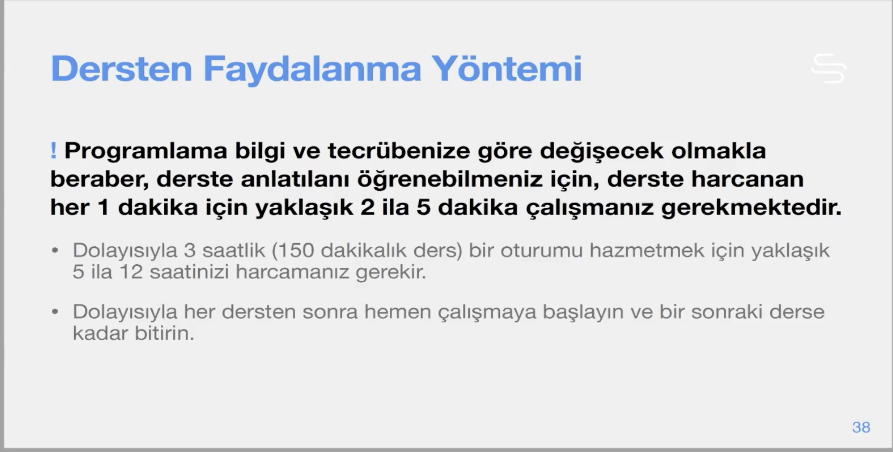

# Section 1: Giriş

# 1.  Eğitimin Tanıtımı

**! Dersleri anlamaniz ve sindirmeniz açisindan sunlara dikkat edin:**

- Her konuyu, sunum ve videolarıyla dinleyin,
- Tüm örnekleri çalıştırın ve detayıyıla, satır-satır ne olduğunu anlayın, kendinize açıklayın.
- Sırayla gidin, bildiğinizi düşündüğünüz konuları atlamayın, gerekirse hızlıca işleyin ama bütünlüğünü bozmayın.
- Örnekler üzerinde bolca oynayın, değiştirin ve deneyin.
- Yeterince anlayıncaya kadar çalımaları tekrar edin.
    
    
    
- 38 saatlik bu kursu hazmetmek için 190 saat civarında bir vakit ayırmak gerekir. bu da günde 3 saatten 63 gün eder.