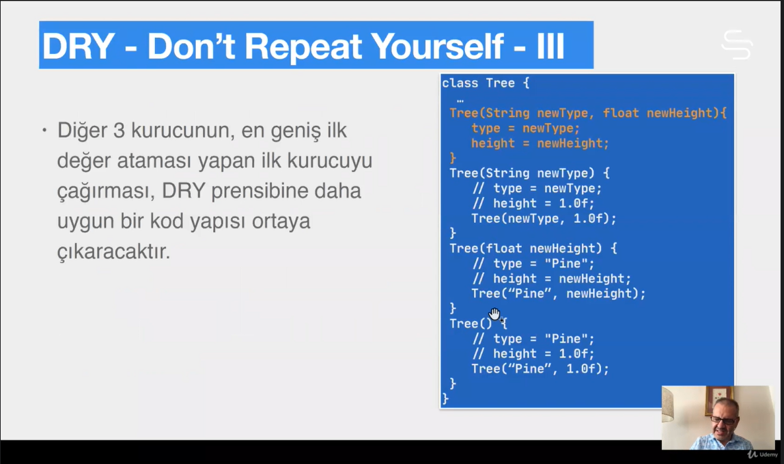
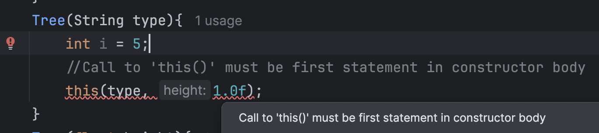
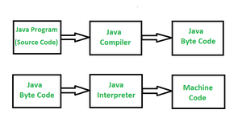

# Section 10: İleri Sınıf ve Nesne Özellikleri

## 55. Kuruculara Giriş

- Kurucular özel metotlardır:
    - Kurucu, içinde tanımlandığı sınıfın ismini alır.
        - İsimleri, diğer metotların aksine **Upper Camel Case’** e uyarlar.
    - Kurucuların dönüş tipi ve değeri yoktur.
        - Sınıfla aynı isimde ve dönüş değeri olan bir metot tanımlanırsa derleyici hata vermez ama o metot kurucu değildir.
    - Kurucular sadece nesne oluşturulurken ve `new` ile çağırılırlar.
- Overload edilebilirler.
- Kurucular üye metot (member method) değildirler bu yüzden ileride göreceğimiz üye metotlar için geçerli olan miras gibi bazı şeyler kurucular için geçerli değildirler.

## 56. Kurucuların Çoklu Kullanımı




- This çağrısı, bir kurucudaki ilk satır olmak zorundadır.
    
    
    
- Aynı şekilde bir constructor overload içerisinde birden fazla this çağrısı yapamayız.
- Aynı şekilde recursive şekilde bir this çağrısı yapamayız.
- Aynı şekilde karşılıklı recursive olamazlar.
    
    
    
- 

## 57. this

- `this`, içinde bulunulan nesneyi gösteren bir referanstır.


- **Metaspace:** Nesnelerin metotlarının kodu, JVM’ in sınıfları yüklediği **metaspace** isimli bellek alanında tutulur.
- `this` anahtar kelimesini return etmek için de kullanabiliriz.

```java
public Tree grow(){
	height++;
	return this;
}
```

- 

## 58. static’e Giriş


Aynı sınıfta her nesne için aynı değere sahip olacak fieldler için static bir sınıf değişkeni oluşturmak daha verimlidir. 

Static değişkenlere ulaşmak için nesneye ihtiyaç yoktur. Sınıf isminden . notasyonu ile ulaşılabilir

Statik metotların içerisinden o sınıfın üye değişkenlerine ulaşamayız. Üye değişkenler birer nesneyle özdeşleştirilir ve nesneler vasıtasıyla erişilir ancak statik metotlar nesneden bağımsız olduğu için bu şekilde bir erişime izin verilmemiştir.

## 59. Ne zaman static?

`public static final` olan değişkenler büyük harflerle aralarında alttan tire olarak yazılır Upper Snake Case.

`java.lang`  paketinin `Math` , `System` , `java.util` paketinin `Arrays` , `Collections`  sınıfları bütün metotları ve değişkenleri statik olan sınıflara örnektir.

singleton denen türden sınıflardır.

Statik kullanarak kod tasarlamaya başlamak bulaşıcıdır ve daha fazla statik kullanmaya bizi bağımlı ettiğinden dolayı, stateful sınıflarda statik kullanmayı yerinde ve zamanında yapmaya dikkat etmeliyiz.

## 60. Başlatma

- Initialization: sınıfın veya oluşturulan nesnenin durumunu kullanıma hazır hale getirmektir. Dolayısıyla, üye değişkenle, sınıf (statik) ve nesne değişkenlerine, ilk değerlerini vermek demektir.
- Başlatmada, önce sınıf başlatılır sonrasında eğer nesne oluşturuluyorsa nesne başlatılır.
    - Sınıf başlatmanın içerisinde, o sınıfın statik değişlenlerinin de başlatılması yer almaktadır.
- Java’ da üye değişkenler için ilk değer atama, aşağıdaki 5 yoldan herhangi birisi ile yapılabilir:
    - Tanımlama cümleleri (definition statements)
    - Kurucular (constructors)
    - Metot çağrısı
    - Nesne başlatma blokları (instance initializer blocks)
    - Statik başlatma blokları (static initializer blocks)
- Tüm üye değişkenlere tanıtıldıkları yerde ilk değer verilebilir bunlara **tanımlama cümlesi (definition statements)** denir.
    - Böyle bir nesneden bağımsız direk sınıf bazında ilk değer ataması çok tercih edilmez.
    - `int counter = 1;`
    - `static double percentage = 5.8;`

## 61. Başlatma Blokları

```java
public class Car{
	int speed;
	speed = 0; // Compiler error!
	static int carCout;
	car count = 1; // Compiler error!
	...
}
```

- Yukarıdaki gibi tanıtma ve ilk değer ataması işlemlerini satırlara ayırmak, derleme hatasıdır.
- Neden bu şekilde ayırmak isteyelim ki?
    - Eğer atanacak değer uzunca bir hesaplama gerektiriyorsa, tanıtmayla atamayı aynı satırda yapamayabiliriz.


- Okunabilirlik açısından en yukarıda olmalarında fayda var.


- Sınıf değişkenlerinin basit değer atamasıyla yapılamayacak kadar karmaşık olan ilk değer atamaları, statik başlatma bloklarında yapılmalıdır.
- Statik üyelerinin başlatılması için oluşturulmuş olan statik başlatma bloklarında sadece statik üyeler kullanılabilir. Nesne üyelerine erişmeye çalışırsak bu üyenin ait olduğu bir nesne olmadığı için temek bir şekilde mantık hatası oluşur ve compiler error verir.
- Statik başlatma bloklarında statik sınıf değişkenleri ve statik metot çağrıları kullanılabilir.
- Sınıf metaspace’ ye yüklendikten sonra başlatılırken çalıştırılır. Dolayısıyla sadece bir kere çalışır.
- Birden fazla sınıf başlatma bloğu varsa yukarıdan aşağıya doğru fiziksel sıra ile çalışır.
    - Hatta bunlar arka tarafta class dosyasının içerisinde birleştirilirler.
- Nesne başlatma blokları derleyici tarafından içinde `this()`  olmayan bütün kuruculara kopyalanır. (Meraklısı bytecode tarafında inceleyebilir)



- Eğer nesne oluşuyorsa her bir yeni nesne için instance initializer’ leri tekrar çağırılır.
    - Çünkü nesne değişkenleri nesneye hastır.
    - Nesne başlatma bloklarında, oluşturulmakta olan nesneye `this`  ile ulaşılabilir.

## 62. Başlatma Sırası

- Bir sınıfın başlatılma sırası şunlardır:
    1. Class yüklenir.
    2. Declare edilir (varsayılan değerleriyle ya da ilk değer ataması verildiyse onunla).
    3. Başlatma blokları çalıştırılır.
        1. Önce static başlatma blokları
        2. Sonra instance variable başlatma blokları çalıştırılır. (Eğer sınıfın bir nesnesi üretiliyorsa çalıştırılır)
- Yani bir sınıfın bir static değişkenine ulaşmak için `ClassA.i` çağrısını kullanmamız, o class’ ın bütün statik değişkenlerine değer atamalarını ve başlatma bloklarındaki bütün kodların yürütülmesini tetikler ardından `ClassA.i`  değişkeninin değerini bize verir.

## 63. Bellek Yapısı ve Çöp Toplama

- Şu ana kadar java’ nın çalışma zamanında kullandığı 3 farklı bellek yapısından bahsedildi:
    - **Stack:** Metotların çalışması için gerekli olan bellek.
        - Yerel değişkenlerin bulunduğu alandır.
    - **Heap:** Nesnelerin yaşadığı bellek.
    - **Metaspace:** Sınıfların, değişken ve sabiteleriyle bulunduğu bellek.
- Hangi nesnelere artık referans kalmadığını belirlemek ve onları memory de boş alan olarak işaretlemek Garbage Collector’ ün işidir.
- Hangi nesnenin artık kullanılmadığına kodun yürütüldüğü kapsamı kontrol ederek bulur. Artık farklı kapsamda kalmış kodlarda yer alan nesnelere bir referans kalmadığı için onları temizler. Referans yoksa nesne de yoktur çünkü.
- Örnek olarak C++’ ta garbage collector yoktur, orada yaptığımız nesne tanımlamalarını işimiz bittiğinde elimizle silmemiz gerekmektedir.
    - Java’ da automatic memory management vardır. Manuel olarak belleği temizlemek mümkün değildir.
- Belleğin temizlenmemesi memory leak (bellek sızıntısı) sorununu doğurur.
- Eğer uygulama çalıştığı esnada yürütülen kodlar bulunduğu kapsam dışına çıkmazlarsa Garbage Collector işini yapamaz memory taşmaya kadar gidebilir.
    - Örnek olarak main metodunda bir for döngüsünde bir milyar tane nesne oluşturabiliriz. Farklı bir kapsama geçme söz konusu olmadığı ve her bir nesneye erişmek mümkün olduğu için garbage collector devreye girmez. Objelerin oluşturulmasına bağlı olarak Heap taşar.
    - Buradaki anahtar kelime referanstır, bu objelerin referansını tutmazsak garbage collector toplar ama for döngüsüyle bir array’ e bu nesneleri doldurursak array index’ inin referansı out of scope olana kadar referansı var olduğu için çöpe atılmayacaklardır.
- Bellek sızıntısından dolayı OutOfMemory hatası oluşur, açıklaması olarak `GC overhead limit exceeded`  yazar. Yani GC tüm heap’ i inceleyip dolaştığı halde silecek bir mb’ lik alan bile bulamamıştır.
- Gereksiz nesne oluşturmaktan kaçınılmalı,
- Nesneler olabildiğince kısa ömürlü oluşturulmalıdır.
    - Gerekmiyorsa nesnelerin referansları metotlara ve dizi gibi torbalara geçilmemelidir. (parametre olarak verilen nesneler artık o yeni kapsamın içinde de yaşarlar.)
- Bir nesnenin silinmesini için nesnenin referansına null ataması yapmak ta gc’ nin onu silmesini sağlamak için kullanılabilir. Büyük nesneler için kullanılan bir yöntemdir.
    
    ```java
    Car car = new Car();
    car.accelerate(120);
    ...
    car = null; //Release the referance
    						// so the Car object can be GCed.
    ```
    
- GC’ nin kullanılmayan nesneleri toplaması bedava değildir. Çalışırken genel olaraka uygulama (stop-the-world, STW) durur.
    - Dolayısı ile JVM’ in kullandığı heap’ i arttırmak, bellek sızıntılarını önlemek için iyi bir yöntem değildir. Bellek ne kadar büyürse toplamak o kadar zaman alır.