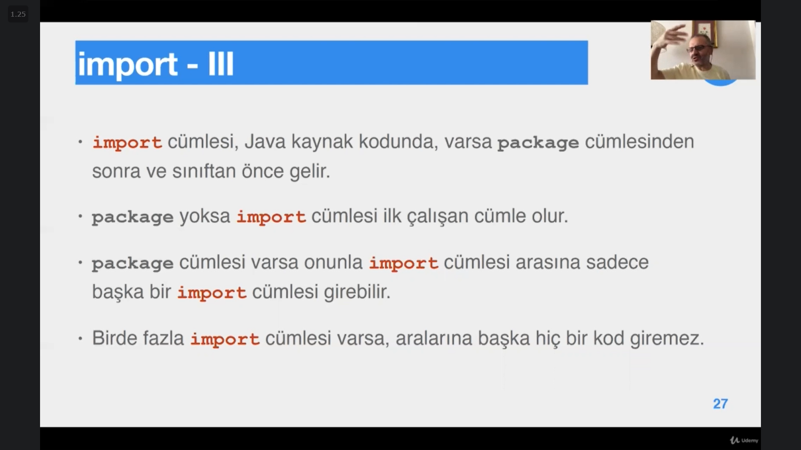
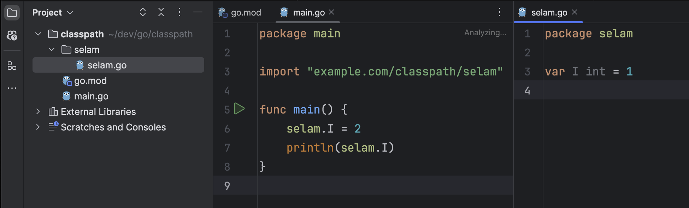

# Section 11: Sınıfların Organizasyonu

## 65. Paket

- Temel amacı isim çakışmalarını önlemektir.
- Bir java dosyasında paket yazmak zorunlu değildir. Paketsiz bir sınıfın paketi varsayılan ya da isimsiz bir pakettir.
- Paketi olan bir sınıfı çalıştırırken JVM’ e (**`java`** konutuna) class ismi geçilirken paketin tam isminin kullanılması gerekir.
    - Ama derleme için değişen bir şey yoktur, çünkü derlenirken dosya ismi kullanılır.

## 66. Paketler Arası Erişim

- Aynı pakette yer alan sınıflar birbirine erişebilir, Farklı pakette yer alan sınıflar birbirlerine tam ismi ile erişebilirler. Ancak bu şekilde erişimin problemli olduğu açıktır.
    - Paket ismi uzunsa eğer bir sınıfı tam ismiyle çağırarak nesnesini oluşturmak 2 satır uzunlukta bir koda neden olabilir. Bunun çözümü de `import` kullanmaktır.

- Gereksiz import cümleleri varsa bu bir derleme ya da yürütme hatasına neden olmaz, Java kullanılmayan bir sınıfı import etmez, sadece kaynak kod dosyasında gereksiz bir görünüme neden olur.

- JVM ihtiyacı yoksa kullanılmayan class ları import etmeyeceği için * ile o paketin altıncaki tüm classları import etmek kötü bir davranış değildir. Tek tek sadece kullanacağımız class’ ların isimlerini import etmek ile bütün bir paketi yıldız ile import etmek arasında performans olarak bir üstünlük yoktur.
- `*` ile alt paketler import edilemez. Aksiz takdirde `java.*`  ile her şey import dilirdi. Sadece belirtilen paketin içindeki class’ lar import edilir ve onların alt paketleri varsa erişilemez. Onların da import edilmesi gereklidir.
- Import sonucu erişmek istediğimiz nesnelerde isim çakışması yaşıyorsak o erişeceğimiz şeyin tam ismini kullanarak hangi nesneye erişeceğimizi özel olarak belirtmemiz gerekir.

---

- **Static import** kolaylık olması için java 5 ile birlikte getirilmiştir.
- Static veri üyelerine ya da static methodlara erişmek için paket ismine kadar ya da static veri üyesi/fonksiyonuna kadar import edilir. Sonrasında kaynak kodunda kullanılacağı zaman Sınıf ismi nokta static veri üyesi veya fonksiyon notasyonuna gerek kalmadan o sınıftan üyeler kullanılabilir.

## 67. Paket ve Dizin

- Java paket yapısında bir kaynak dosyasında belirtilen **`package`** ifadesindeki adresin birebir klasör dizin yapısına uyması gereklidir.
- java derleyicisine `-d` flag’ ı ile birlikte `javac` komutu geçilirse, bu dizinin altında pakete uygun dizinler oluşturulur ve **class** dosyası belirtilen dizine konur.
    - `javac -d ./bin Selam.java` (bin klasörü içerisinde paket yapısına uygun olaraktan binary dosyaları oluştur)

## 68. Classpath

- java compiler’ i java dosyalarını compile ederken eğer, o dosyanın içerisinde import ifadesi ile başka bir paketteki class’ ı import ettiysek kendiliğinden o pakette yer alan .class dosyasını bulamaz. import edilen yerin bulunamadığını `classpath`  hatası ile bize bildirir.
- Bunun sebebi java, import edilen class’ ların package adresini kaynak koddan gördüğü halde, bilgisayarda bu sınıfların binary class dosyalarının users/…/… altında nerede arayacağını bilmemesidir. (`javac` komutunun çalıştırıldığı terminalde o esnada bulunduğu dizini classpath olarak kabul edip arayacağı paketleri buradan itibaren aramayı neden akıl edemiyor ben de anlamadım. Gayet temiz bir kısayol olurmuş yazılımcıyı uğraştırmamak adına.)
- Environment değişkenleri arasına `classpath` isminde bu class dosyalarının olduğu ana dizini verirsek, java bu classpath’ in altında artık package yolunu takip edebilip orada o `.class` dosyasının olup olmadığına artık bakabilir.
- Go da ise bu classpath zımbırtısının sorumluluğunu go.mod dosyaları üstlenir.
    - aşağıdaki gibi bir alt klasördeki `I`  değişkenine main dosyasından erişmek istediğimizde öncelikle go mod tanımlamalarını yapmak zorundayız. Ardından import cümlemize package direcktory’ i yazarken go mod dosyamıza verdiğimiz parametreyi kullanarak path içerisinde ilerleyebiliriz.
    - Javadaki classpath, go’ daki go mod’ a verdiğimiz modül isminin yerine geçiyormuş gibi anladım ben.
    
    
    

- Classpath’ e dizin 3 şekilde eklenir:
    1. `javac` ve `java` komutlarında classpath seçeneğiyle,
    2. CMD (ya da TERM/XTERM vb.) komut satırının oturumlarında `CLASSPATH` değişkeni tanımlayarak, (export),
    3. `CLASSPATH` değişkenini sistem değişkeni olarak ekleyerek.
1. yöntem:

## 69. Eclipse’ de Paket ve Classpath

- Eclipse, yeni yaratılan bir proje dizininin altında `src` ve `bin` isimli iki dizin oluşturur.
    - bin dizini altında, kodların paketlerine uygun olarak oluşturulmuş dizinin yapısı ve dizinlerde de `class` dosyaları bulunur.