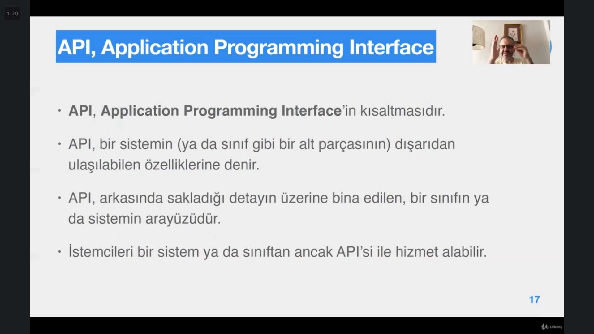

# Section 12: Sarmalama ve Erişim Yöntemi (Encapsulation)

## 71. Sarmalama ve Bilgi Saklama

- İnglizceleri: Encapsulation, Access Control
- Encapsulation: Verinin, o veri üzerinde çalışacak metotlarla birlikte bir yapı altında toplanmasına denir.
    - encapsulation, soyutlamanın tasarlanmış hali olarak düşünülebilir.
    - Sınıf ta sarmalamanın gerçekleştirilmesi olarak düşünülebilir.

## 72. Sınıf Erişim Kontrolü

- Bu eğitimde java modüllerini göz ardı edeceğiz. Bu nedenle aşağıdaki bilgiler yer yer yanlış ve eksiktir.

- C++ ta private yazabiliyorduk, Java da direk hiçbir access modifier yazmadığımızda private olarak kabul ediliyor.
    - Aynı şekilde `friend` keyword’ te yok.
- public anahtar kelimesi yazılmamışsa o nesnenin erişim niteleyicisine **paket erişimi (package accessibility)**, **varsayılan erişim (default accessibility)** ya da **arkadaşça erişim (friendly access)** denir.
- Bir sistemin arayüzünde yani API’ sinde olacak sınıflar public yapılır, diğerleri varsayılan erişime sahip olur ve API de görünmezler.

## 73. Üye Erişim Kontrolü

- `protected`**:** miras olarak devralan alt sınıflara erişime açıktır.
    - Paketteki sınıflar da `protected` üyelere erişebilir.
- Üye veriler (member variables) `public` yapılmaz çünkü üye değişkenler nesnenin bilgisidir, bilgi saklanır bu nedenle `private` olurlar.
    - Static ve final olan değişkenler, sabitler, diğer sınıfların ihtiyaç duyacakları durumlarda `public` ya da **varsayılan** erişime sahip olurlar.

- **Varsayılan erişime (default access)** sadece paket içerisinden erişim söz konusundur, paket dışından ulaşılamaz.
    - Bu erişime **package-private** te denir.

## 74. get/set Metotları

- Tüm üye değişkenleri `private` olan bir sınıf söz konusu olduğunda, üye değişkenlerinin değerini okuyup değer kaydedeceğimiz bir use case her zaman olacaktır.
- bu üye değişlenlerinin `public` olduğu ve direk kullanıldığı bir senaryoda, istemcim bu değişkenleri kullanırken ben sınıf tasarımında bir değişiklik yapıp üye değişkenlerin isimlerini değiştirirsem, istemcimin kodunda değişikliğe gitmem gerekir.
- Get set metotları hizmet değil, bilgi alış verişini sağlayan yapılardır.
    - gereksiz/aşırı kullanımı nesneler arasındaki bilgi alışverişini arttırır.
    - Bilgi alışverişinden olabildiğince kaçınmamız gerekir.
- Bilgi alışverişinin zorunlu olabileceği yerler için örnekler:
    - Bu nesnenin durumunun bir web/mobil arayüzden gösterilmek istenmesi ya da bu arayüzlerden girilen değerlerin nesneye aktarılması gerekmesi.
    - Nesnenin durumunun veritabanında saklanması gerekmesi ya da yeni bir nesnenin üye değişkeninin veritabanındaki değer ile başlatılması gerekmesi.
- Bağımlılığı düşürmek için istemci kodlarının içerisinde get set metotlarını kullanmaktan kaçınmalıyız. 3 gün sonra sınıf tasarımında bir değişikliğe gidilirse get set metotlarını sürekli kullanan bu istemcinin kodları da bozulur ve değişikliğe ihtiyaç duyar.

## 75. JavaBean

- Bir sınıfın **javaBean** olabilmesi için;
    - Public varsayılan kurucusu olması,
    - Varsa, durum bilgisini oluşturan değişkenlerin özellik (property) olarak tanımlanmış olması
- gerekir.
- Bir nesne değişkeninin özellik (property) olabilmesi için;
    - Sınıfta `private` olarak tanımlanmış olup, `public`  set/get metotlarıyla ulaşılabilir olması
- gereklidir.

## 76. Değişmez Nesne

- **Değişmez nesne (immutable object)**, **fonksiyonel programlama (functional programming)** paradigmasının en temel prensibidir.
- Peki nasıl functional programming yapılır? (Durumu değişmeyen nesne nasıl yapılır?)
    - Nesnenin tüm alanlarını `private` ve `final` yaparak,
    - `set`  metotlarını kullanmamak,
    - Varsayılan kurucu (default ya da no-arg constructor) sağlamamak, gerekliyse private yapmak,
    - Sadece argümanlı kurucuları mümkünse sadece bir tane sağlamak,
        - Bu durumda tüm final alanların ilk değer atamalarının burada yapılması gerekmektedir.
- `private` dışarıdan korurken, `final`  de içeriden değişiklik ihtimaline karşı korur.
- Final sınıflar devir alınmaz override edilemez.

## 77. Ödevler

