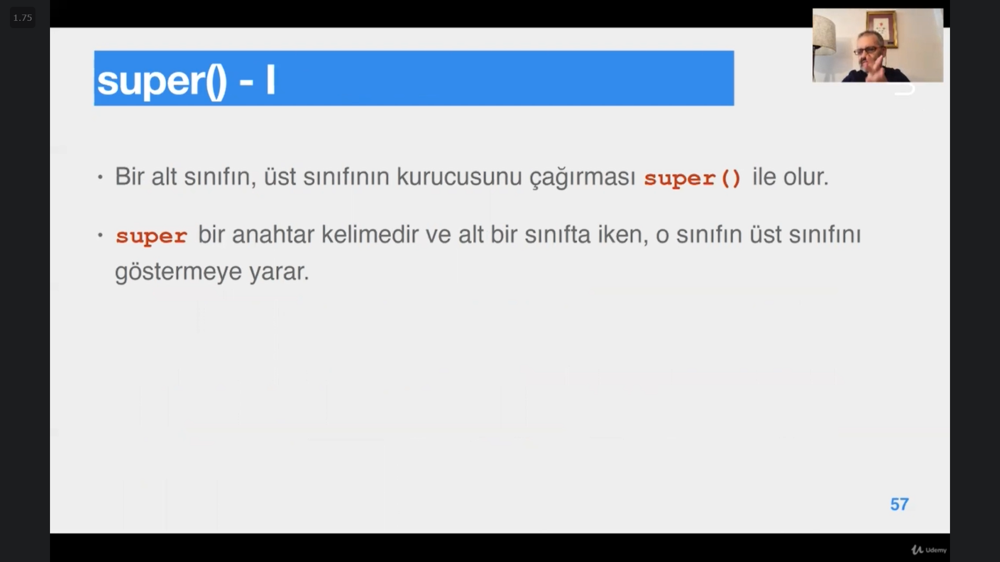
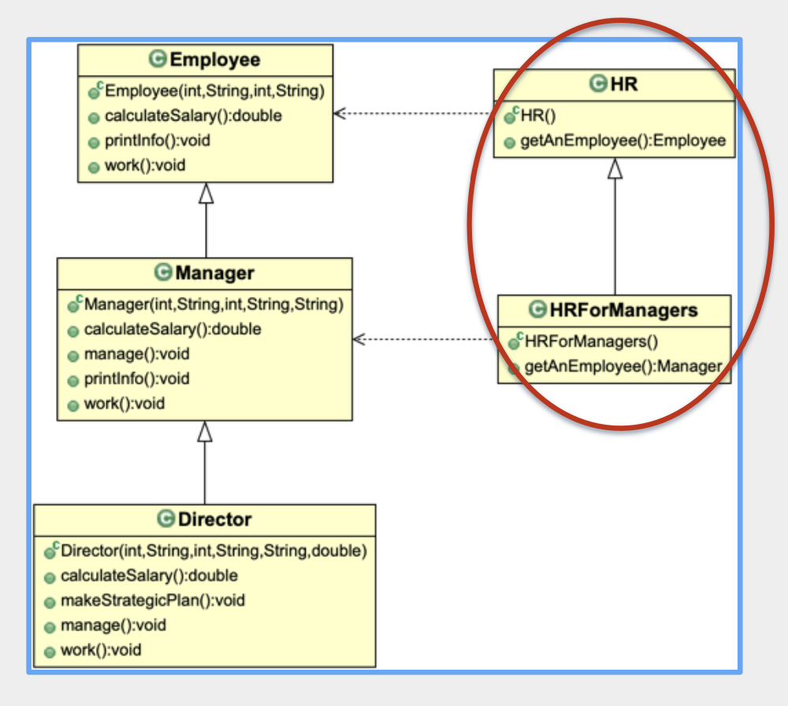
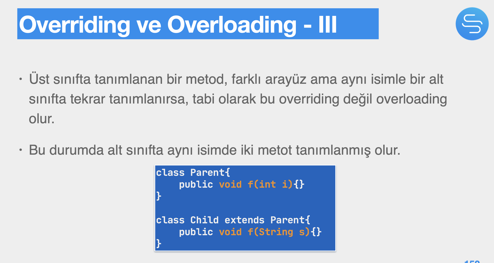
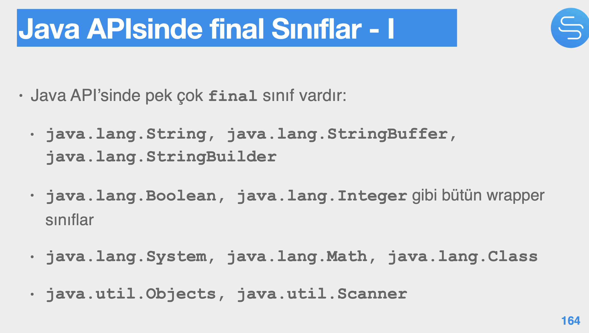
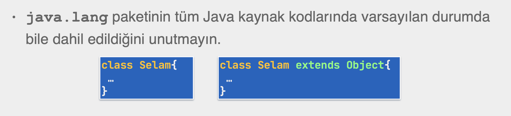
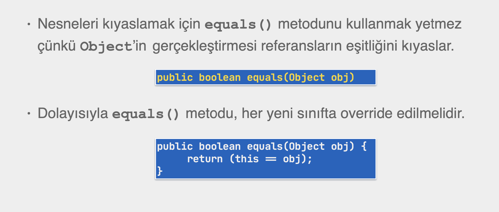

# Section 13: Tekrar Kullanım ve Miras

## 78. Giriş

- **Tekrar Kullanım (Reusability):** lego blokları gibi, var olan yazılım yapıları ile yeni yapılar geliştirmektir.

## 79. Bileşim (Composition)

- **Nesne bileştirme (object composition):** Birden fazla nesneyi bir araya getirerek daha karmaşık nesneler oluşturmaktır.
- **Bileşik nesneler (composite objects):** Genel olarak, başka sınıfların nesnelerini, nesne değişkeni olarak kendinde barındıran nesnelerdir.
- Nesne bileştirme ile nesneler arasında bir **ilişki (association)** ve aynı bir **bağımlılık (coupling)** oluşturulur.
- Bileşik nesneler kendilerinden istenenleri bileşenlerinden hizmet alarak gerçekleştirirler.
    - Buna **yönlendirme (delegation)** denir.
- Bileşik nesnelerde bileşenlerin nerede oluşturulacağı karar verilmesi gereken bir konudur.
    - Bileşik nesnede tanıtıldığı yerde ya da kurucusunda oluşurulabilir. **(Composition)** (genel olarak daha sıkı)
    - Başka bir yerde oluşturulup nesneye geçilebilir. **(Aggregation)** (genel olarak daha gevşek)

## 80. Mirasa Giriş

- Kendisinden miras alınan sınıfa **ebeveyn/üst (parent/base/super)** sınıf, miras alana ise **çocuk/türetilen/alt (child/derived/sub-class)** sınıf denir.
- `extends` anahtar kelimesi ile kullanılır.
- Erişim yönetiminde, alt sınıfların, üstlerin **protected** üyelerine erişmesinden bahsedilirken kastedilen, miras olarak devralmadır.
    - Ama **public, varsayılan** ve **private** üyelere erişim erişim ile kastedilen hem ulaşma hem devralmadır.

## 81. Tekli ve Çoku Miras

- **Single inheritance** ve **multiple inheritance** olarak tekli ve çoklu miras alma çeşitlerinden çoklu miras almayı Java desteklemez.
- Multiple inheritance’ ye ihtiyaç duyduğumuz durumları java’ da `interface` kullanarak hallediyoruz.

## 82. Kurucular ve super

- Kurucular miras olarak devralınamazlar.
    - Dolayısı ile her türetilen/alt/çocuk kendi kurucusunu tanımlamak zorundadır.
- Her alt sınıf, üst sınıftaki bir kurucuyu çağırmak zorundadır.
- Her çocuk nesnesinin içerisinde gizli de olsa bir ebeveyn nesnesi vardır.

- `super` çağrısı zorunludur.
    - Eğer yoksa derleyici, alt sınıfın tüm kurucularına varsayılan bir `super` çağrısı koyar.
    - Eğer üst sınıfta bir varsayılan kurucu yoksa, `super()` çağrısı hata verir.
        - Bu durumda `super(..)` ’ e bir argüman vererek üst sınıfın akıllı bir kurucusu çağırılmalıdır.
- `super` çağrısı içinde bulunulan kurucuda ilk çalışan kod olmalıdır.
    - Dolayısıyla alt nesne oluşmadan önce içerisindeki gizli üst nesne oluşur.
- Aynı kurucuda hem `super()` çağrısı hem de `this()` çağrısı olamaz.
    - Çünkü this çağrısı akışı bir başka kurcuya yönlendireceğinden, `super()` çağrısı sadece içinde `this()` kurucularda olabilir.
- Derleyici, içerisinde `this()` olmayan tüm kurucularına bir varsayılan `super()` çağrısı koyar.

## 83. Başlatma ve Miras

- **Başlatma sırası (initialization order):** sınıfın yüklenmesi ve sonrasında nesnenin oluşturulmasında, değişkenlerin, başlatma blokları ve nihayetinde kurucu çağrısının hangi sırada yapılacağını belirler.
- Bir sınıf başlatılmadan önce, daha önce başlatılmamışsa, onun üst sınıfı başlatılır.
- Birden fazla sınıf ve nesne değişkeni olduğu durumda başlatma sırası, fiziksel sırayla belirlenir, önce gelen önce başlatılır.
    - Bunun tek istisnası, statik olan sabite değerlerin **(constant variable)** diğer sınıf değişkenlerinden önce başlatılmasıdır.
        - Bölüm 9 da ele alınmıştır.

## 84. super ve Gizleme

- `super` keyword ile içinde bulunduğum context’ e bir üst nesneyi göstermeye çalışmanın bir anlamı yoktur. (bir üst nesne implicit bir nesne zaten)
- `super` erişimi, üst sınıf ya da üst sınıfın nesnesine yönlendirmeye yarar.
    - `super` ile hem sınıf, hem de nesne üyelerine ulaşılabilir.
- Bir sınıf üst sınıftaki nesneleri devraldığı, dolayısıyla onlara doğrudan erişebilmesi söz konusuyken neden bu üyelere `super` kullanarak erişmeye çalışsın ki?
    - Cevabı, gizleme (saklama) (hiding) olduğu zaman kullanılır.
- Eğer alt sınıf, üst sınıftan devralacağı bir üyeyi kendisi tekrar tanımlarsa, alt sınıf o üyeyi devralamaz. Bu durumda erişmek istediğinde kendi üyesine erişir.
    - Buna **gizleme (saklama)** denir. Üst sınıfın saklanan üyelerine erişmek için `super` anahtar kelimesi kullanılır.
- Tekrar tanımlama, alt sınıf, üst sınıftaki üyeyi;
    - Değişken ise aynı isimde,
    - metot ise aynı arayüzde tanımlayarak yapılır.
- Değişken gizlemenin anlamlı bir kullanımı yoktur. Bu sebeple pek yapılmaz.
- Aslında metotlarda gizleme sadece statik metotlar için geçerlidir.
    - Yani üst sınıfın statik metodu, alt sınıfta aynı arayüzle tekrar tanımlanırsa, bu metot gizleme olur.
- Üst sınıfın nesne metotlarını tekrar tanımlamaya gizleme denmez, bunun çok farklı bir kullanımı ve adı vardır.
    - **Ezme** ya da **Overriding** denir.
- Instance metotu instance metodunu ezebilir, override edebilir.
    - Ancak alt sınıftaki bir sınıf metodu, üst sınıftaki bir nesne metodunu gizleyemez,
    - benzer şekilde alt sınıftaki nesne metodu, üst sınıftaki bir sınıf metodunu da gizleyemez, aslen bu ezme girişimidir ama bir hatadır.
    - Bu şekilde çapraz durumlara dikkat etmemiz gerekir.
    - Ama tabiki statik metot statik metodu gizleyebilir. Orada `super` kullanımı anlamlıdır.
- `super` sadece nesne metotlarında, nesne başlatma bloklarında, kurucularda ya da nesne değişkenine atamada kullanılabilir.
    - Bunlar dışında kullanımlar derleme hatasıdır.
    - Örneğin `super` statik bir bağlamda kullanılamaz.
- `super`  bir referans değildir, O sınıftan parametre alan bir metoda parametre olarak vermek istersek compiler error olur. Çünkü bir referans değildir, bir nesne göstermez, sadece üst sınıfın hiding üyelerine ya da metoduna ulaşmamızı sağlar.

## 85. Genişletme ve Yerine Geçebilme

- Miras katmanlarındaki herhangi bir alt sınıf, üst sınıfının özel hali olarak onun tipinden olduğundan, üst sınıfın olduğu ya da beklendiği her yerde, alt sınıflardan birisi kullanılabilir.
    - Bu durum, **yerine geçebilme (substitutability)** olarak ifade edilir ve miras katmanlarında aşağıdan yukarıya doğru çalışır.
    - “Üst sınıfla çalışan bir istemci, alt sınıfla da rahatlıkla çalışabilmelidir.” demektir.
    - Alt sınıflar üstlerinden devraldıkları metotlara eklemeler yaparak daha geniş bir arayüz ile daha çok iş yapar hale gelseler bile, asgari seviyede üstlerinin arayüzünü desteklemeye devam ederler.
- **yerine geçebilme (substitutability)** sadece metotlar için geçerlidir, üye değişkenler için geçerli değildir. Parent sınıftaki public bir metodu child bir sınıfta override ederken private’ ye çekemeyiz, bu sınıf arayüzünü daraltmak manasına gelir, alt sınıflar ana sınıfın arayüzünü desteklemek zorundadır. Yani override edilen metotu private’ ye çekersek compiler error verir.

## 86. Ezme

- Eğer alt sınıf, üst sınıftaki bir statik metodu tekrar tanımlarsa buna **gizleme (hiding)** denir.
- Eğer alt sınıf, üst sınıftaki bir nesne metodunu tekrar tanımlarsa buna **ezme (overriding)** denir.
- Ezme ya da overriding, sadece nesne metotları için söz konusudur.
    - Bu şekilde override edilen metotlara **polymorphic (çok şekilli)** metotlar denir.
    - Ne kadar alt sınıf varsa, aynı arayüzün o kadar sayıda farklı gerçekleştirmesi olabilir.
- Bir sınıf bir metodu ezerken, devralınan metodun dönüş tipini, dönüş tipinin alt bir tipiyle değiştirebilir.
    - Buna **covariant return tipe** denir.
    - Yani alt tipteki ezen metot, üst tipteki metodun döndürdüğü tipin daha özel tipini döndürebilir, yerine geçebilme özelliği hala korunur
        
        
        
- **Overloading**: bir simin aynı sınıftaki farklı metotlarda kullanılmasıdır. Geçilen parametreler farklı olduğundan, overloaded metotların imzaları (dolayısı ile) arayüzleri farklıdır.
- **Overriding**: üst ve alt sınıfta arayüzleri aynı olup gerçekleştirmeleri farklı olan metotlarla yapılır.
    - **Covariant return type** özelliğinden dolayı dönüş tipleri değişebileceğinden, ezilen ve ezen metotların arayüzleri sadece dönüş tipinde fark edebilir.
- Kısaca **overloading** isimle, **overriding** ise metot arayüzü ve gerçekleştirmesi ile yapılır.
- çünkü parametre tipleri farklı:
    
    
    

(Bu şekilde sınıflar arası da overloading yapılabilir.)

- Override edilen metotlar `@Override` ile notlandırılabilir.
    - `java.lang` paketindeki metotlardan birisidir ve niteliği metodun override edildiğini ifade eder.
    - Zorunlu değildir ama hatalardan korur.
    - Bu not kullanıldığı halde override yapılmazsa derleyici hata verir.

## 87. final Sınıflar ve Metotlar

- `final` sınıflar mirasa konu olamaz, kendisinden miras devralınamaz, alt sınıfları olamaz yani hiçbir sınıf tarafından üst olarak görülemez.
- Fakat `final` tanımlanan sınıflar, başka sınıflardan miras devralabilirler.
- Bir sınıfın final yapılmasının alt sebepleri şunlar olabilir:
    - Sınıfın sağladığından daha iyisinin yapılamayacağını düşünmek,
    - Özellikle alt seviye teknik detay içeren sınıflar için, güvenlik (**security, reliability-safety)** gibi sebepler,
    - Mirasın oluşturduğu yüksek bağımlılıktan kaçmak.
- `final` sınıfların tüm durum değişkenlerinin de `private` olması beklenir, `protected` yapmaya gerek yoktur çünkü devralınamayacaklardır.
- `final` sınıfların metotlarının da `protected` olmasına gerek yoktur, her yerden erişilmeleri isteniyorsa `public` yapılabilir.

- `Math` sınıfı tamamen statik üyelere sahiptir ve üzerindeki metotlar, ezilmeyi gerektirmeyecek kadar tamdır, bu yüzden `Math` sınıfı `final` dir.
- `System`  ve `Class` sınıfları, Java ve JVM’ in çalışma mantığına uygun olarak geliştirilmiş, pek çoğu alt seviye işletim sistemi çağrılarına (native methods) sahip metotlara sahiptirler, bu yüzden değiştirilmeleri düşünülmemelidir.
- Metotlar da final olabilir.
    - Eğer bir nesne metodu `final` olursa, o metot ezilemez.
    - Eğer bir sınıf metodu `final` olursa, o metot gizlenemez.
    - `final` olan metodun tek bir gerçekleştirmesi vardır, o da üst sınıftadır.
- `final` olan bir sınıfın tüm metotları doğrudan `final` olur, metotların ayrıca `final` olarak tanımlanmalarına gerek yoktur.
- Hem `private` hem de `final` metot ne anlama gelir?
    - Bir metot `private` iken, o metodu `final` yapmak gereksizdir.

## 88. java.lang.Object

- java.lang.Object sınıfı, bütün java sınıflarının doğrudan ya da dolaylı olarak kendisinden miras devraldıkları sınıftır.
    - Bütün miras katmanlarının en üstündeki sınıftır.
    - Üst sınıfı yoktur.
        
        
        
- `toString()`, nesnenin `String` tipindeki sunumunu üretir ve geri döndürür.
- `public String toString()` default olarak `Object` sınıfında nesnenin tam ismi ile hash kodunu döndürür.
- `==` eşitlik kontrolü sadece basit tipler için kullanılmalıdır.
- Nesnenin durumunu kıyaslamak için `equals()` kullanılır.
- 
    
    
    
- `equals()` metodu, üzerinde çağırıldığı nesnenin durumuyla, kendisine geçilen nesnenin durumunun eşitliğini kontrol edecek şekilde ezilmelidir.
    - Ayrı objeler olduğunu biliyoruz sadece içeriklerini check ediyoruz.
- **Hash kod**, bir tam sayıdır ve JVM’ in her nesne için bellek adresini kullanarak ürettiği 2^32 int değerinden biridir.
    - İki nesnenin `==` kontrolü uygulanırken `.hashCode()` metodundan da yararlanılabilir.
    - java api’ sinde HashSet vb. torba (collection) nesneleri tarafından, kendisine eklenirken kullanılan bir metottur.
- `hashCode()` ve `equals()` metotları birbiriyle tutarlı bir şekilde override edilmelidir.
- `equals()` metodunun `true` döndürdüğü nesneler için `hashCode()` da aynı `int` değeri, hash kodu olarak döndürmelidir.
- Bu durumlar sağlanmazsa, özellikle state’ leri aynı olan nesneler için tutarsız haller olabilir.

## 89. Bileşim, Miras ve Sarmalama

-