# Section 14: enum, Java API’si ve Ana Sınıflar

## 90. enum

- Tarihi temsil eden bir sınıfın implementasyonunda olması gereken, bu gibi alanların alabileceği sınırlı değerlerin **sabite (constant)** olarak bir yerde tanımlı olmasıdır.
    - Java uzunca bir süre bu problemi, ilgili sınıflarda tanımladığı `public static final` sabitelerle yönetti.
- Değer uzayı problemini çözmenin daha güzel bir alternatifi **enumeration (sıralama)** yapmaktır.
- `enum` kendi tipinden ve belirli sayıda nesneleri sıralayan, özel bir tiptir.
    
    ```java
    enum Size {
    SMALL, MEDIUM, LARGE, EXTRA_LARGE;
    }
    ```
    
- `enum` tipi `public` ya da varsayılan erişime sahip olabilir.
- `enum` alanları daima `public`, `static` ve `final` ’dır yani sabitedir ve sadece kendi içinde tanımlanabilirler.
- Sabitlerin tipi tanımlanan enum’ ın tipidir ve tipin üzerinde erişilir.
    - Bu yüzden Upper Snake Case yazılırlar.
- `,` ayrılarak dizilirler.
- `;` den sonra başka sabite tanımlanamaz.
    - Sabiteler dışında başla bir şey yoksa `;` ile bitmesine gerek yoktur.
- Sabiteler `enum`tipinin en başında, varsa diğer tüm alanlar ve metotlardan önce tanımlanmalıdır.
- `enum`, sınıflarda olduğu gibi kuruculara sahip olabilir.
- kurucuları sadece `private` erişim niteleyici alabilir. `public` ya da `protected` kullanımı hatadır.
- Eğer hiçbir niteleyici kullanılmazsa, varsayılan halde paket erişimine değil, `private` erişime sahip olur.
    - Bu nedenle sadece tipin içinde çağırılabilirler.
        
        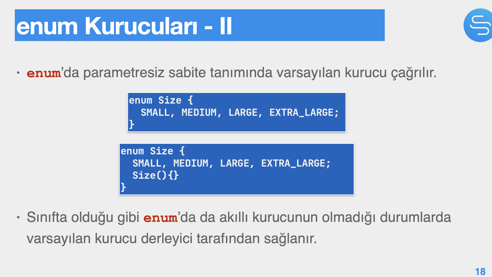
        
- `enum` tipi, diğer sınıflar gibi sınıf ve nesne başlatma (initializers blocks) sahip olabilir.
    - Ama nesne başlatma blokları ya da kurucular, statik bir alana ulaşamazlar.
- `enum` tipinin bir alanına ya da statik bir metoduna ulaşıldığında başlatılır ve tüm sabiteleri oluşturulur.
- `enum` tipinin en başında kendi tipinden statik sabiteler tanımlandığından, başlatmada önce **nesne blokları** sonra **statik bloklar** çalışır. (sınıflarda bu sıralama ters işliyordu)
- 4 tane kendi tipinden sabitesine sahip olan bir `enum` tipi için 4 kez object initializer block çalışır sonrasında `static` initializer block çalışır.
    - 
        
        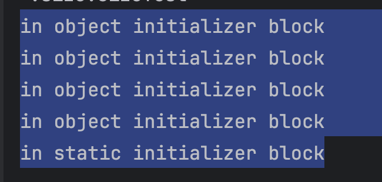
        
        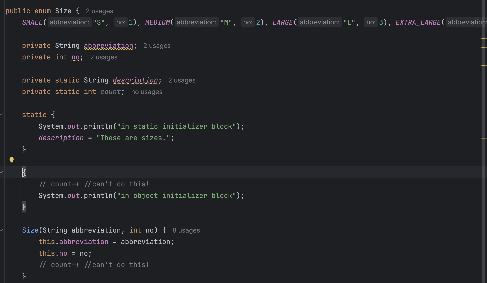
        
- `enum` tipi, sınıflar gibi `public` ya da varsayılan erişime sahip olabilir.
- `enum` tipi üstü kapalı bir şekilde (implicitly) `final` ’ dır dolayısıyla genişletilemez, hiçbir başka tip tarafından üst tip olarak tanımlanamaz.
    - Ama `enum` u final tanımlamak derleme hatasıdır.
- `enum` ’da main metot tanımlanabilir.
- En çok kullanılan `enum` metotları:

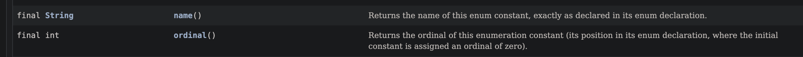

([https://docs.oracle.com/en/java/javase/21/docs/api/java.base/java/lang/Enum.html](https://docs.oracle.com/en/java/javase/21/docs/api/java.base/java/lang/Enum.html))

- 
    
    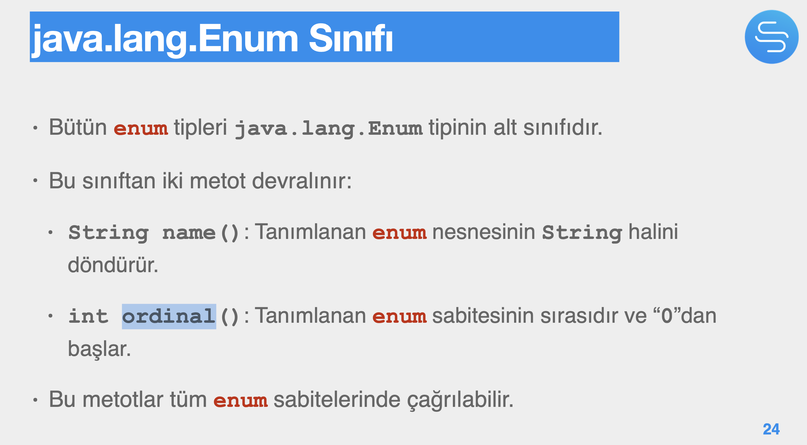
    
- `enum` tipi için double equality ile `.equals()` aynı çalışır çünkü enum sabiteleri sadece birer tane üretilir ve her yerden o aynı nesneye erişilir.
    - `.toString()` metodunda olduğu gibi override ederken `.equals()` ’ı override etmeye gerek yoktur.

## 91. Java API

- Kütüphanelerin arayüzüdür.
- `public` ve `protected` üyeleri içerir.
- Başarılı bir Javacı Api yi etkin bir şekilde kullanmalı ve tekerleği yeniden keşfetmemelidir.

## 92. Uygulama- Java API’si Nasıl Kullanılır?

## 93. Sarmalayan Sınıflar

- 8 tane basit-ilkel (primitive) tipin nesnelerini temsil eden sınıflara **sarmalayan (wrapper)** sınıf denir.
- `java.lang` paketindedirler.
- 
    
    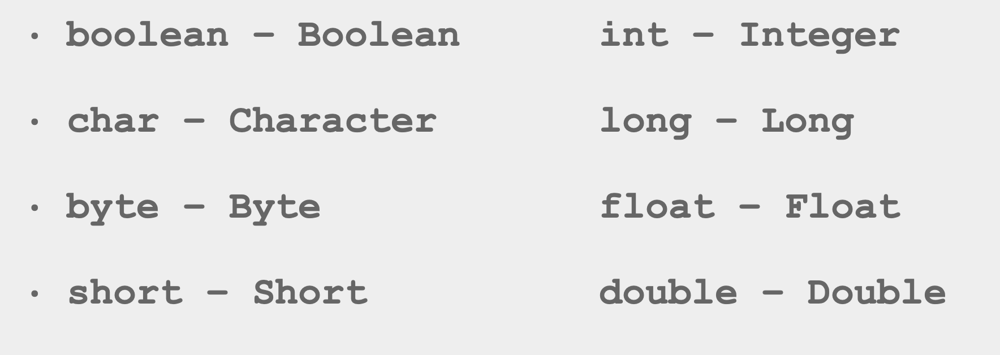
    
- İlkel tipleri kullanmak daha kolaydır. Gerekmedikçe wrapper tipleri kullanmamak lazım.
- Sarmalayan sınıfların kendi ilkel tipinden parametre alan bir kurucusu vardır ama bu kurucular deprecated yapılmışlardır.

```java
public Boolean(boolean value)
public Integer(int value)
```

- Kurucu çağrısı yerine doğrudan ilkel tipleri atanarak nesne oluşturulmalıdır.

```java
Boolean bObject = true;
int i = 47
Integer iObject = i;
```

- type casting’ e gerek kalmadan ilkel tipler ile primitive tipler arasındaki dönüşümler otomatik olarak yapılır:

```java
int i = 8;
Integer iObject = i; // Auto-boxing
int ii = iObject; // Auto-unboxing
boolean b = false;
Boolean bObject = b; // Auto-boxing
boolean bb = bObject; // Auto-unboxing
```

- String ve array gibi wrapper’ ler de özel objelerdir. `new` olmadan oluşturulabilirler.

## 94. String Sınıfı ve String İşleme

- `java.lang.String` , Java’nın karakter dizilerini gösteren sınıfıdır.
- `String` , `Final` bir sınıftır dolayısıyla miras devralınamaz.
- nesneleri iki şekilde oluşturulabilir.
    - `new` kurucu çağrısı ile
    - Kurucu çağrısı yapmaksızın, `""` ile.
- Her `String` kurucu çağrısı yeni bir `String` nesnesi oluşturur.
- Her `""` çağrısı yeni bir `String` nesnesi oluşturmaz. Eğer daha önce oluşturulmuşsa `String` havuzundaki nesneye bir referans döndürür.
    - Havuzda yoksa yeni `String` nesnesi oluşturulur ve havuza konur.
- Dolayısıyla `new` ile `String` kurucu çağrısı her zaman yeni bir nesne oluştururken `""` çağrısı yeni bir nesne oluşturmayabilir.
- `String` nesneleri değişmezdir (immutable)
- Bunun pek çok sonucu vardır.
    - `String` nesnesi bir sabitedir ve sistemde aynı sabiteden birden fazla olmasına gerek yoktur:
        - Dolayısıyla `String` oluşturmak için `new` ile kurucu çağrısı yapmak yerine `""` kullanmak avantajlıdır çünkü bu daha az nesne oluşturmak anlamına gelir.
    - Bu da GC için daha az iş çıkaracağından JVM’in performansı için olumludur.

```java
String s1 = new String(“Java”);
String s2 = new String(“Java”);

System.out.println(s1 == s2); // false
String s3 = "Java";
String s4 = "Java"; // Not a new object!

System.out.println(s3 == s4); // true

System.out.println(s1 == s3); // false
```

- s1 Heap’ te s3 ise Metaspace’ teki pool’ dadır.
- `String` nesneleri değiştirilemez olduğundan, değiştirmek için yapılacak her şey yeni bir `String` nesnesi oluşturur.
- `+` operatörü de daima yeni bir `String` nesnesi döndürür.
- `String` API’ sindeki `concat()` gibi `String` nesnesini değiştiren metotlar da daima yeni bir `String` nesnesi döndürürler.
- Bu yüzden değiştirilecek, düzenlenecek ya da bir kaç adımda oluşturulacak karakter dizileri için `String` sınıfını kullanmayın.
- Oluşturma veya değiştirme için **StringBuilder** ve **StringBuffer** sınıflarını kullanmalıyız.
    - Oluşturma veya değiştirme işlemleri bittikten sonra `String` nesnesi oluşturulur.
    - İkisinin de üzerindeki `toString()` metodu işleneni yeni bir `String` nesnesi olarak geriye döndürür.

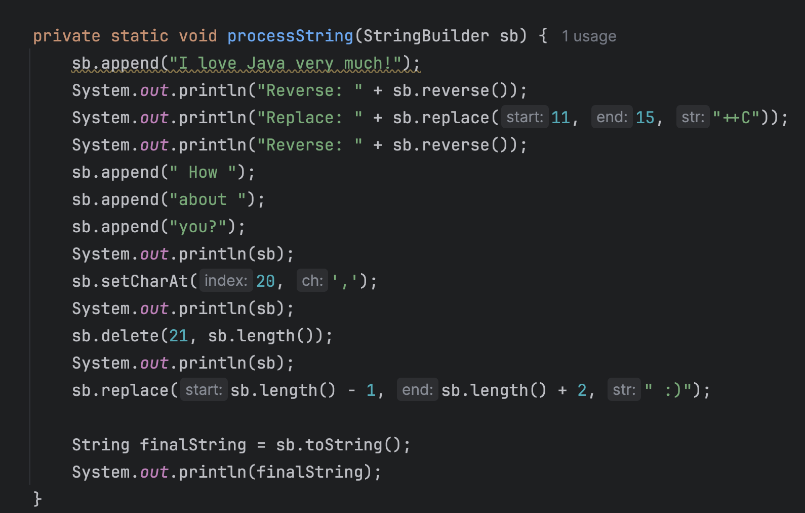

- **StringBuilder** ve **StringBuffer** kullanılarak kaynaklardan büyük tasarruf etmek mümkündür.

## 95. Math ve Random Sınıfları

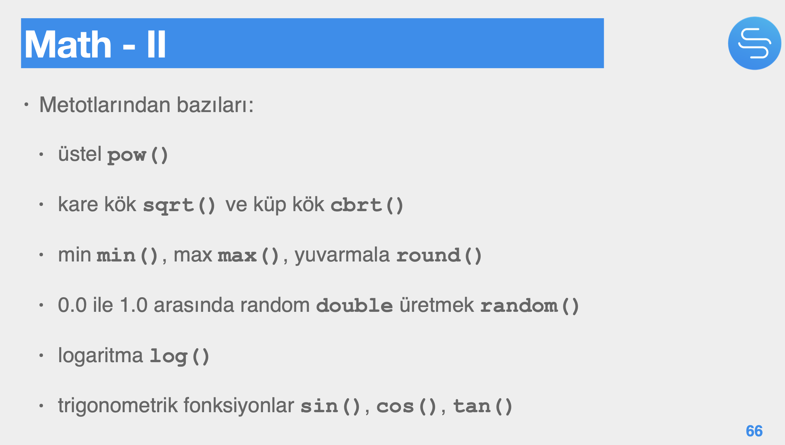

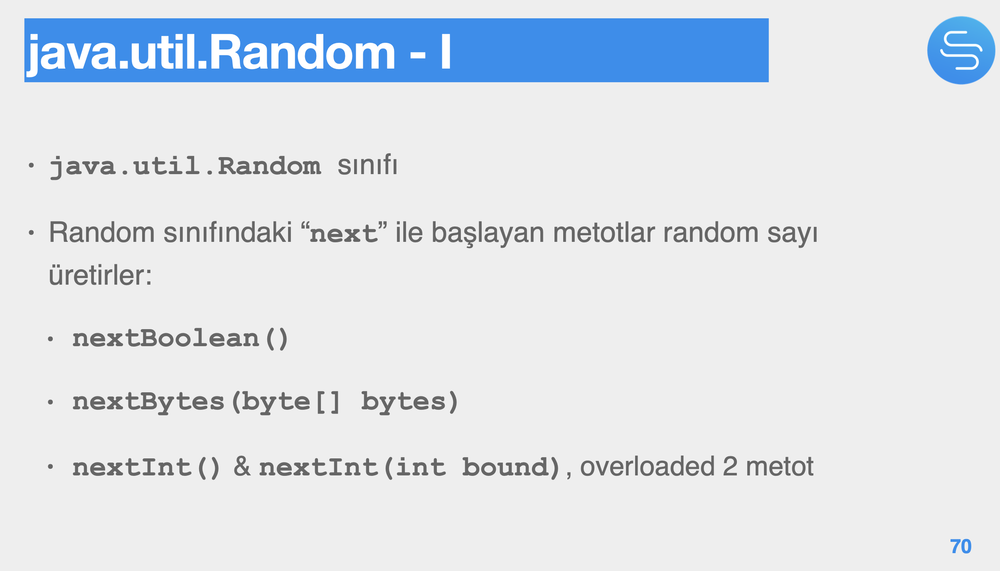

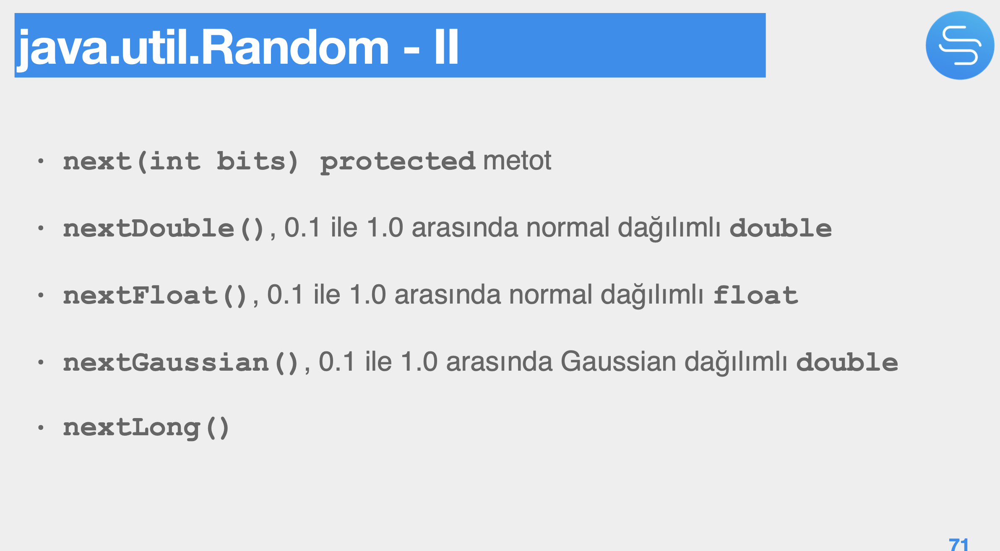

## 96. BigInteger ve BigDecimal

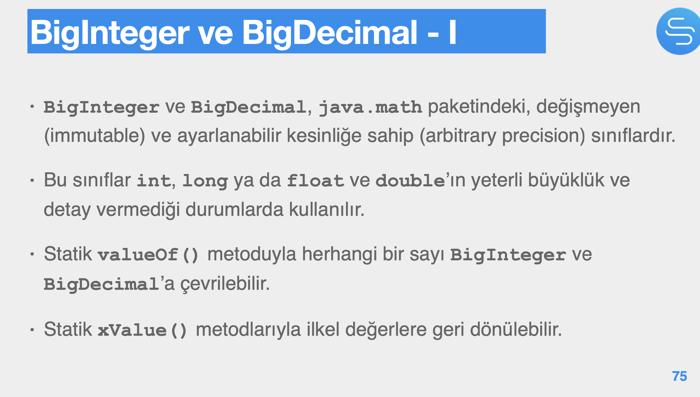

- Bir milyar sayının ardışık toplamı integer bir sayıyla temsil edilemeyeceği için örnekte olduğu gibi `BigInteger` sınıfı kullanılmalıdır.
    - Daha büyük sayılarda `long` tipi de yetmeyecektir. `BigInteger` kullanılarak sorunların önüne geçilebilir.
    
    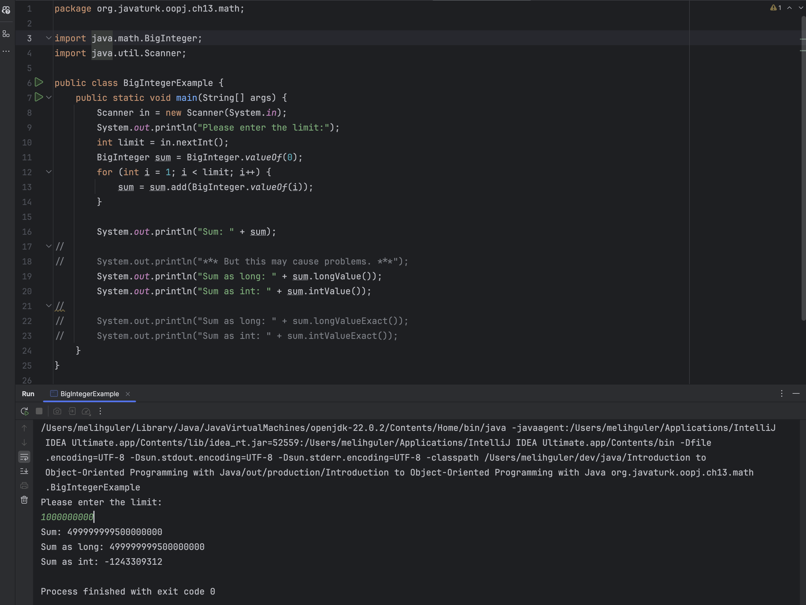
    
- Faktöriyel hesaplarken `long` tipi patlarken `BigInteger` büyük sayılarla başa çıkacaktır.
    
    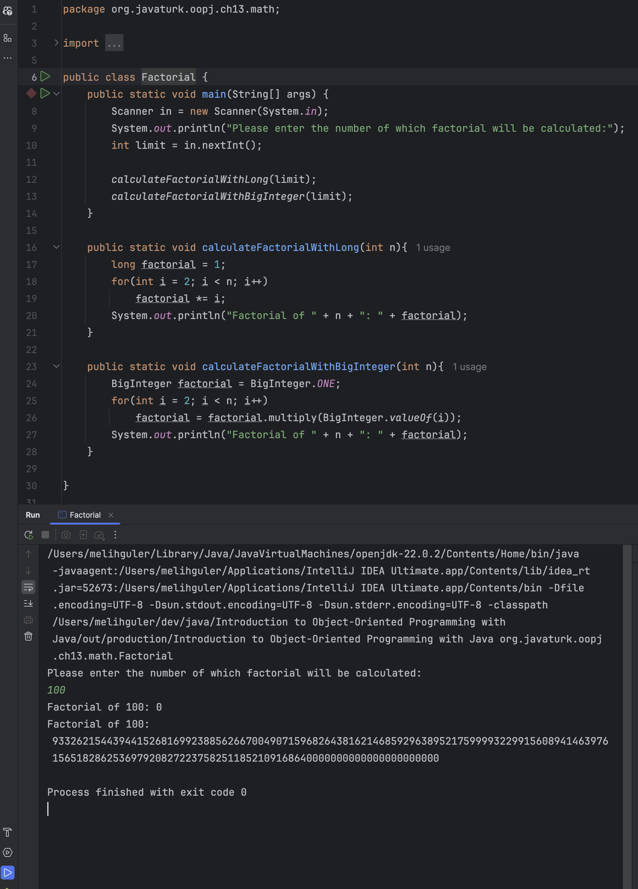
    

## 97. Date ve Calendar

- `Date` sadece 1 Ocak 1970 (GMT) den bu yana geçen milliseconds bilgisini long olarak tutar.
    - `Date()` ve `Date(long time)` kurucuları vardır.
    - `getTime()` / `setTime(long time)` metotları vardır.
- Ayrıca Java 8 ile gelen yeni yapıdaki Instant sınıfıyla ilgili olarak, (Date api sinin bir parçası)
    - `static Date from(Instant instant)` metotu vardır.
- `Date` , zaman bilgisini işletim sisteminden aldığı için, verdiği zaman bilgisi mutlak değildir.
- `java.util.Calendar` , takvimi ifade eden soyut bir sınıftır.
- `java.util.GregorianCalendar`, dünyada en çok kullanılan takvimi ifade eden tek somut alt sınıftır.
- `Calendar` takvim sınıfı ile `Date` zaman sınıfı sıklıkla birlikte kullanılır. Çünkü o anki zaman ile o anki takvim bilgisi arasında gidip gelmek söz konusudur.
    - Bu amaçla `Date getTime()` , `void setTime(Date date)` kullanılır.

## 98. Yeni Date ve Time API’si

- Java SE 8 ile yeni bir yapı geldi.
- Varsayılan takvim Gregorian takvimidir.
- Bu sınıflar çoğunlukla immutable nesneler üretir bu yüzden `set` metotları yoktur.
- Nesne üzerinde değişiklik yapan metotları, yeni nesne döndürürler.

## 99. Notlar

- Java’ da “@” ile başlayan ve tip, metot, değişken, parametre vb. yapıları niteleyen öğelere not (annotation) denir.
- Notlar programın bir parçası değildir ve program akışını doğrudan etkilemez.
- Amaçları:
    - Derleyiciye bilgi verir.
    - Derleme ve deployment-time işlemlerinde kullanılır. (Spring gibi frameworklerde çoğunlukla kullanılır) (xml ile de yapılabildiği yerler vardır ancak annotation genel kullanılan yaklaşımdır.)
    - run-time işlemlerinde kullanılır.
- Annotation kullanımları bazen isteğe bağlıdır, bazen daha fonksiyonel amaçlar için kullanılır.
- Notlar, Java API’sinin bir parçasıdır.
- package-summary **Annotation Types Summary** başlığında api sayfasında listesi yer alır.
- `jaca.lang` paketindeki notlardan `@Override` gibi.

## 100. Jar Oluşturma ve Kullanma

- **JAR,** Java’nın arşiv formatıdır. (Java’nın zip’i gibidir.)
- Ticari olarak ya da open source olarak sağlayacağımız bir kütüphanenin **class** dosyaları ve ilgili diğer türden dosyalarını bir araya getirip tek bir dosya olarak kullanmanın yolu **jar** oluşturmaktır.
- Java’ nın kütüphane (library) formatı `.jar` dosyalarıdır.
- Jar olarak oluşturulmuş kütüphanelerin kullanılabilmesi için classpath’ e eklenmelidir.
- Bu şekilde jar içindeki yapılar projede ulaşılır hale gelir ve sınıflar ve statik üyeler import edilerek kullanılır.
- JAR dosyaları aynı zamanda çalıştırılabilen (executable) Java yapıları olarak ta oluşturulabilir.
    - Bu durumda `jar` dosyaları komut satırından ya da uygulama sunucularına verilerek te çalıştırılabilirler.
- `jar` komutu ile konsoldan kullanılır. Dizin ya da dosya ismi belirterek istediğimiz kaynakları jar’ a sıkıştırabiliriz.