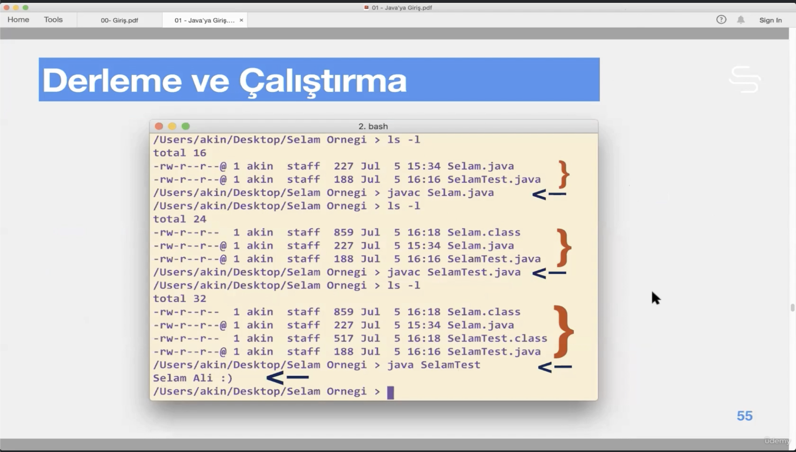

# Section 2: Java’ ya Giriş

## 2. Java Nedir

- C ve C++ tan daha basittir.
- Daha soyuttur, üzerinde yazılan makinenin donanım özelliklerinden bağımsızdır.
- Dinamik tipli bir dil değildir. Aksine Statik tipli bir dildir.
- Java’ nın dinamik olmasıyla kastedilen, tipleri çalışma zamanında (runtime) yükleyebilmesidir.
    - Dolayısıyla Java’ da bir programın kullanacağı tipler, uygulamanın derlenmesi ya da ayağa kalkması sırasında hazır olması gerekmez.
    - Bu durum web’ in tabiatına daha uygundur.
- Platformdan bağımsızdır.
    - Örneğin int her platformda 32 bittir.
- Ayrıca, Java ve JVM, platformlarla alakalı sadece en gelem ön kabule sahiptir.
- Java’ nın platformdan bağımsız olması ve **yorumlanan (interpreted)** tabiatı, onu aynı zamanda taşınabilir (portable) kılmaktadır.
- Derlenmiş (compiled) java kodu, `.class` dosyasında **bytecode** olarak saklanır.
    - **Bytecode** platformdan bağımsızdır, JVM’ in olduğu her yerde çalıştırılabilir.
- Nesne Merkezlidir.
- Procedural: C, C++ Object Oriented: Java, C++, C#
- Bir farklı açıdan ayırım da **derlenen diller, yorumlanan dillerdir.**
    - Compiled: C, C++, Rust, Go
        - Derleme Demek: Benim yazdığım source kodun makinenin alayacağı hale çevirilmesi demektir.
        - Derlenen diller çok hızlıdır. İşin büyük kısmını derleme esnasında halleder ve bize çok hızlı çalışan bir yürütülebilir dosya üretir.
        - Ancak bu derleme işlemini her platform için ayrı ayrı yapmak zorundayızdır.
    - Interpreted: JavaScript, Python, PHP
        - Yorumlanan dillerde, .exe ya da .out gibi bir son kod oluşturmayız.
        - Satır satır kodu okuyarak, makinenin içerisinde kayıtlı olan yürütme kodlarını çağırır. Doğrudan çalıştırır. Buna yorumlama denir.
        - Her platform için ayrı ayrı derleme gerektirmez, her platformda direk çalıştırılabilir.
        - Yorumlama kodu daha kırılgan yapar, Hatalar çalışma zamanında ortaya çıkar.
        - Diller arasındaki by farklar Just-in-time compiler teknolojisi sayesinde azaltılmıştır.
        - Kaynak koda yapılan değişiklikler  çalışma zamanında doğrudan görünür.
            
            
            
- Java hem derlenir (compiled) hem yorumlanır (interpreted). Her iki yaklaşımın da en iyi taraflarını bir arada toplamak için bu şekilde tasarlanmıştır. C++’ ta sadece compiler var, python’ da sadece interpreter var, Java’ da hem compiler var hem interpreter var.


- MyProgram.java’ dosyasını Compiler ile compile ettiğimizde, Makinenin anlayacağı bir yürütülebilir kod üretilmez. Bir ara kod üretilir buna B**ytecode** denir. 8 bitten oluştuğu için bytecode denir. Bu bytecode’ den sadece JVM anlar. (java virtual machine).
- JVM de kendisine gönderilen bytecode’ leri bir yorumlayıcı olarak okur ve satır satır çalıştırır.


- Bir java kodunun sistemlere dağıtımı söz konusu olduğunda `.java` kodu değil, derlenmiş olan `.class` kodu o sistemlere dağıtılır ve sistemlerin kendi içlerindeki kurulu **JVM** ler tarafından yorumlanır.
- Bilgisayarımıza Java kurduğumuz zaman 2 şey kurulur. Bunlardan biri `javac` (java compiler’ idir) biri de java yorumlayıcısı olan `java` dır.

## 3. İlk Java Kodumuz

- `Selam.java` ve `SelamTest.java` dosyalarını compile edeceğiz ve ikisinin de class dosyalarını oluşturacağız.
- `java` komutuna da çalıştırmak istediğimiz main dosyasının olduğu sınıfın ismini vererek bytecode’ yi yorumluyoruz.



- Bytecode dosyasını konsola bastırmak için:

```bash
javap -c SelamTest.class
```

## 4. İlk Java Kodumuz (Devam)

- Olabildiğince programlarımızı nesen merkezli olarak yazmalıyız. Her kavramın kendi nesnesini oluşturarak yazmalıyız.

## 5. Java’ yı Öğrenmek

## 6. Java’ nın Diğer Özellikleri

- Java’ nın 3 farklı tür uygulamaya yönelik 3 farklı paketi vardır:
    - Standart Java (Standart Edition, SE) Çekirdek dildir.
    - Mikro Java (Micro Edition, ME), gömülü ve mobil uygulamalar için.
    - Kurumsal Java (Enterprise Edition, EE), kurumsal uygulamalar içindir.

## 7. Neden Java?

- [https://www.tiobe.com/tiobe-index/](https://www.tiobe.com/tiobe-index/) Programlama dillerinin popülerlik indeksi. July 25, 2024 itibari ile java 4. sırada. (turuncu olan)
    
    