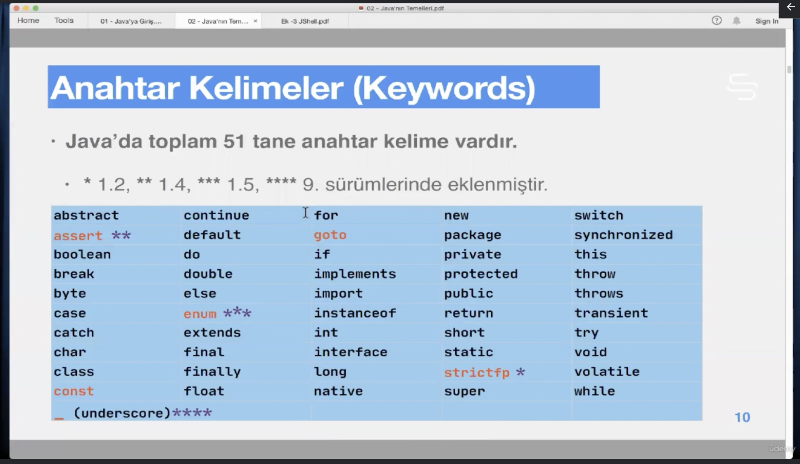
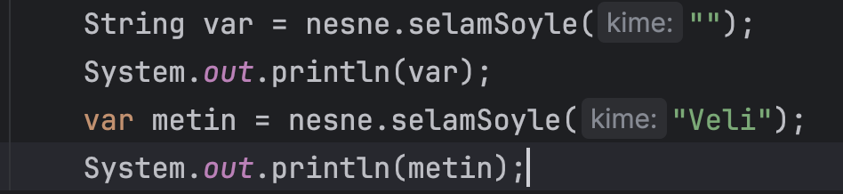
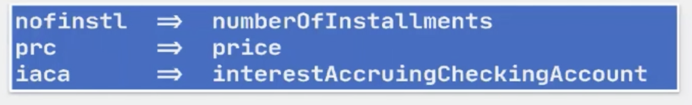

# Section 3 Java’nın Temelleri

## 8. En Temeller

- Bir programda, boşluk (white space) ve yorumlar (comments) dışında kalan her şey bir **simge** ya da **sembol** dür (**token**).
- Simge ya da sembol, derleyicinin işlediği ve anlamlı olan en küçük program parçasıdır.
- Java’ nın simgeleri Unicode’ dur. ( Yani Unicode ile Java’ nın simgeleri oluşturulur.)
- Java’ da 5 farklı tipte simge (token) vardır:
    - **İsim** ya da **belirteç** (**identifier**)
        - `i` `j` `MyClass` `Customer` `calculateCurrentRatio`
    - **Anahtar Kelime** (**Keyword**)
        - `new` `class` `int` `for` `if` `volatile` `synchronized`
    - Değer ifadeleri, **sabite (literal)**
        - `2` `3.1415` `true` `'c'` `"Java"`
    - **Ayraç (seperator):** Java’ da 12 tane ayraç simgesi vardır.
        - `()` `{}` `[]` `;` `,` `.` `...` `@` `::`
    - **İşlemci (Operator):** Java’ da 38 tane operator vardır.
        - `=` `+` `==` `>` `<` `?` `>>>` `++` `||`
- Bir Java programının söz dizimi, yukarıda verilen 5 tür simge, bu simgeler arasındaki boşluklar ve uygun yerlerde bulunan yorumlardan ibarettir.
    - Buna **söz** ya da **kelime kuralları** (**lexical grammar**) denir.
- Bir Programın geçerli olabilmesi, yani hatasız derlenip çalışabilmesi için, sembollerin belli bir kurala göre kullanılmış olması gerekir.
    - Buna da sözdizimi **kuralları (syntactical grammar)** denir.
- Anahtar Kelimeler:

- goto ve const değişkenler birer keyword olarak ayrılmışlardır (reserved) evet ama hiçbir işlevleri yoktur. `const`’ un yerini `final` karşılamaktadır.
- `null` , `true`  ve `false`  kelimeleri de Java sabiteleridir. Değişken isimleri olarak kullanılamaz.
- `var` anahtar kelimesi Java 10 ile birlikte gelen yeni bir ayrılmış (reserved) kelimedir. (ama keyword değildir
    - Yerel değişken oluşturmada kullanılır.
    - `var`  ile değişken oluşturulurken tip verilmesi gerekmez, Java tip bilgisini ortamdan (context) çıkarır (inference). Buna **tip çıkarımı (type inference)** denir.
    
    
    
- Yorumlar:
- **JavaDoc:**
    - Api documentation olarak kullanılır, apayrı bir formatlanması vardır ‘@’ gibi anahtar kelimeleri vardır. İleride detaylandıracak.
- **İsimlendirme Kuralları:**
    - Anahtar ve ayrılmış kelimeler isim olarak kullanılamazlar.
    - İsimler sadece harf ile başlayabilirler.
    - İsimler bir rakam ile başlayamazlar ama sonraki karakterlerinde rakam olabilir.
    - İsimler, `" ' . , ; : ! ? / \ - | # &`  gibi, boşluk dahil, **noktalama işaretleri**ni (**punctuation markers**) içeremez ma “alt çizgi” “_” kullanılabilir. Hatta “_” ile başlayabilir ama genel kabul olarak kullanılmazlar.
    - Unicode içeridesindeki para birimleri de isimlerde kullanılabilir ama genel kabul olarak kullanılmazlar.
    - Java 9’ dan itibaren sadece `_` isim olarak kullanılamaz çünkü artık bir anahtar kelimedir.
    - Kodlanmış kısa isimlerden ziyade uzun isimler kullanmak tercih edilir.
        - Örnek:
            
            
            
    - Birleşmiş milletler dil sistemine Unicode denir, Java da unicode kullandığı için Türkçe Arapça İbranice Çince Hintçe Japonca Almanca vb. dillerdeki harfler de kullanılabilir. Fakat yine de isimlerin İngilizce yazılması genel kabuldür.

## 9. Java Kaynak Kod Yapısı

- **İfade (expression):**  Tek bir sonuç üretecek şekilde, dilin kurallarına uygun olarak değişkenler, ,işemciler (operators) ve metot çağrılarından oluşan yapıya ifade (expression) denir.
- Birden fazla ifade bir araya gelerek, **birleşik ifade (compound expression)** oluşturur.
- Java’ da **sabite ifadeleri (constant expression)** dışındaki ifadelerin değerleri, çalışma zamanında (run-time)belirlenir.
- **Sabite ifadeleri (constant expression),** değerleri derleme zamanında (compile time) belirlenebilen ve çalışma zamanında değişmeyen ifadelerdir.
- Değeri çalışma zamanında belirlenen sabite (5 gibi bir sayı bir sabitedir (literal) [bkz](media.md).) ifadeleri dışındaki ifadelerde, yani (int j = i + 1) gibi bir tanımlamada bile java derleyicileri çalışma zamanında belirlenecek bilgileri, derleme zamanında **bilseler** bile bir işlem yapmazlar.
    - Bu durumda oluşabilecek sıkıntılı durumlardan programcı sorumludur.
    - Unit test (birim test), bu gibi durumları ortaya çıkarır.
- nesne yaratma için new anahtar kelimesini kullanılır. `new Selam();` yaratılacak nesnenin kurucu metot çağrısı (constructor call) gelir.
- Obje oluşturmak o objeyi kullanmak için yeterli değildir. Kendisine ulaşmakta kullanılacak olan ve nesne ile aynı tipte olan bir referansa atamak gereklidir.
    - `Selam referance = new Selam();`
    - Sağ tarafta oluşturulan nesne, sol taraftaki Selam tipinde reference isimli bir referansa atanmaktadır.

## 10. Java Kaynak Dosyas

- package ve import cümleleri zorunlu değildir, varsa paket sadece bir tane olabilir ama istenildiği kadar import yapılabilir.
    - Varsa package ifadesi bir kaynak kodunda ilk çalışan kod olur.
- public sınıf kendi ismini taşıyan dosyada yer  almak zorundadır.
    
    
    

- bir kaynak kodda birden fazla public sınıf olamaz.
- Java da private sınıf olamaz.

## 11. Main Metot

- Main  Metot yazılışı

## 12. Ödevler

1. sayfa student book / cevapları 380