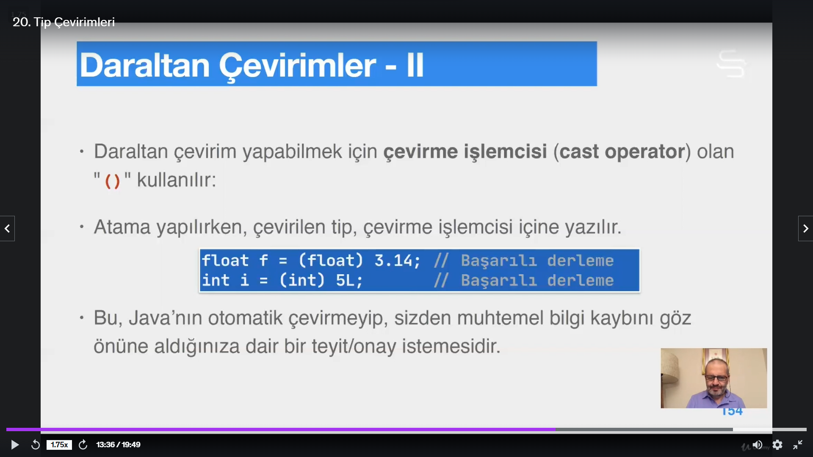

# Section 4: Tipler ve Değişkenler

### 17. var Ile Yerel Değişken tanımlama

- var kullanıldığında ilk değer ataması yapılmak zorundadur.
- var ile veri üyesi tanımlanamaz.

### 18. Kapsam

- Java da global değişken yoktur

### 20. Tip Çevirimleri

- Cast operatörü tip değişimlerinde kullanılan

### 21. Değişmezlik ve Final

### 26. Sayısal Yükseltmeler ve İşlemci Çoklu Kullanımı

