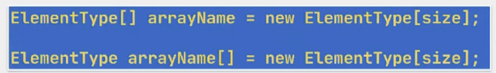
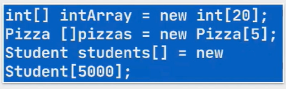

# Section 7: Diziler

## 38. Diziler - Tanımlama ve Erişim

- Bütün dillerde olduğu gibi Java da da birden fazla ilkel değişkeni ya da referansı yönetmeyi sağlayan torba (collection) yapıları vardır.
- Java’ nın util paketinde yetenekli bir **torba çerçevesi (collection framework)** vardır.
    - Bu torbaları ileride ayrı bir bölümde ele alacağız.
    - Bu torbalardan ilk olarak en temeli olan, diziler (arrays) ele alacağız.
- Dizilerin 2 tane kısıtı vardır:
    - Uzunlukları sabittir ve bu bilgi dizi oluşturulurken verilmelidir.
    - Homojen veri yapılarıdır, aynı tipten verileri tutarlar.
- `[]` işaretinin nerede olduğunun önemi yoktur, tipten ya da referanstan sonra olabilir.
    - Yaygın kullanım tipten sonra olmasıdır.
- Dizi oluşturulurken kurucu çağrısı yapılmaz, bu çağrıyı JVM halleder.
    
    
    



- Bir dizi oluşturulduğunda, odalarındaki elemanlar, dizinin tipinin varsayılan değerleri ile doldurulur.
    - Bu değer boolean için false, diğer 7 sayısal ilkel tip için 0’ ın bir türüdür.
    - Referans tipler için ise varsayılan değer null’ dur.


### 39. Dizilerde For Each


- foreach yapısı atama yapmak için kullanılamaz. read only dir.


### 40. Çok Boyutlu Diziler


- Neden sadece ilk boyuta length bilgisi vermek zorundayız?

Çünkü eğer 2. veya 3. boyuta da uzunluk verirsek onların hepsinin uzunluğu aynı olmak zoruda kalır. Bu da matris üretiyoruz demektir. Matris üretmek zorunda değiliz. Farklı farklı boyutlarda olmasını istiyorsak iç boyutlara uzunluk ataması yapmamıza gerek yok.


### 42. Main Metoda Parametre Geçme


```java
 Integer.parseInt(args[2]); // ile tip dönüşümleri yapabiliyoruz
```