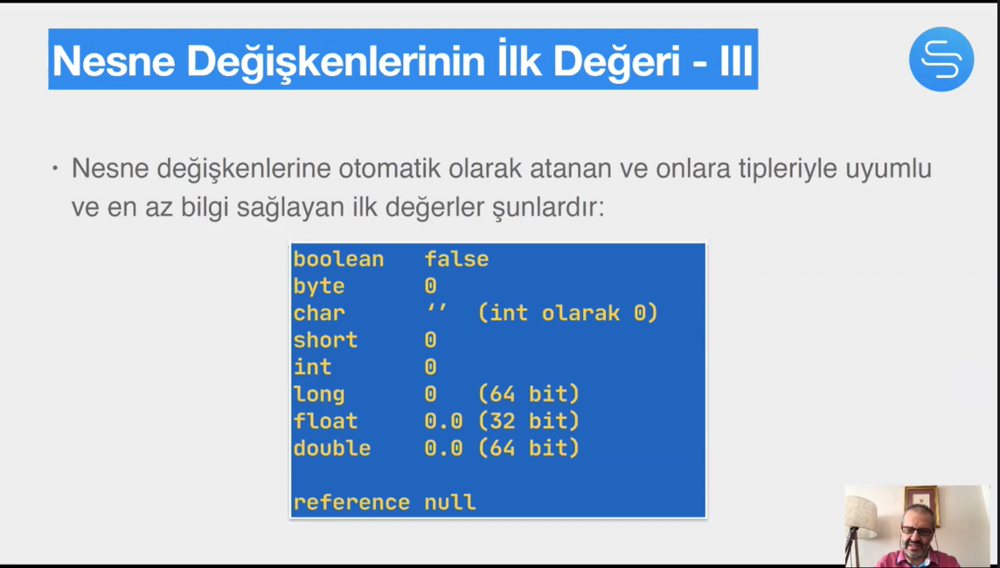
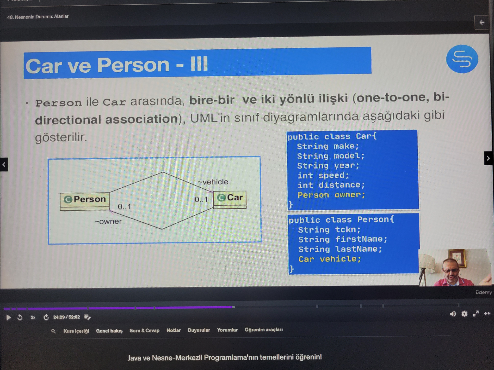
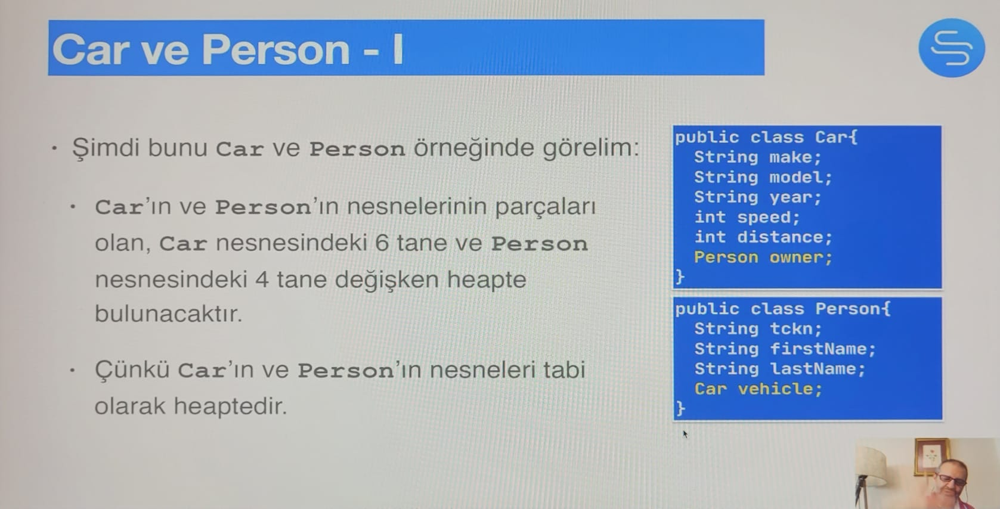

# Section 9: Sınıflar ve Nesneleri

## 48. Nesnenin Durumu: Alanlar



- Nesne, sınıftan türetilen ve bir duruma ve bir grup davranışa sahip olup, **heap** isimli bellek alanında yaşayan yapıdır.
- Referans ise, nesneye ulaşmamızı sağlayan ve **stack** veya **heap’** te bulunan bir değişkendir.
- **Soru**: Bir referans ne zaman stack’ te ne zaman heap’ te bulunur?
    - Bir referans, zamanın farklı anlarında, kendi tipinde olduğu müddetçe, değişik nesneleri gösterebilir.
    - Fakat bir anda sadece tek bir nesneyi gösterir.
    - Bir nesneye birden fazla referans olabilir.
    - yerel değişlenler (local variables) **stack**’ te bulunur.
        - Örnek olarak main içerisinde tanımladığımız Car car; tanımı ile oluşturulan değişken de stack’ te bulunur çünkü main içerisinde oluşturduğumuz değişkenler, referanslar (nesneler değil sadece onların referansları) kendi scope lerinde bulunan birer değişkendir.
    - Bir sınıfın kompleks tiplere sahip attribute’ leri için söz ediyorsak bunların nesneleri heap’ te bulunur ve birbirlerine zincirleme bağlı şekilde bellekte bir graph oluşturabilirler.
        - Örneğin Car sınıfının içerisindeki bir String make; alanı da bir referanstır ve aslında bir String sınıfı nesnesinin heap adresini tutan, heap’ te bulunan bir referanstır ve onun değeri de heap’ te tutulur.
        - String gibi sınıflar olmak zorunda değil, int char bool gibi primitive tipler de birer nesne alanı iseler heap’ te tutulurlar. (35. dakikada güzel açıklıyor)
    
    
    
    
    

## 49. Nesnenin Davranışları: Metotlar

- Metotların exception tanımlarının olduğu, isimden sonra kıvırcık parantez başlangıcına kadar bulunan boşlukta önümüzdeki eğitimde işleyeceğimiz bir alan vardır.
- Normalde methodlar buralarda tanımlanan exceptionları döndürebilirler.

## 51. İmza Arayüzü ve Çoklu kullanım

- Bir metodun, isim ve parametre listesinden oluşan bilgisine imza denir. (signature)
- Dönüş değeri, tipi ve exception (sıra dışı durumlar), imzaya dahil değildir.
- Bir metodun, isim, parametre listesi, dönüş değeri ve fırlattığı sıra dışı durumlardan oluşan bilgisine arayüz (interface) denir.
- `<access modifer>* <return type> <isim> (<Parameter>*) throws <exception>*`
    - `public double squared(double arg) throws IllegalArgumentException`
    - Burada bir interface veri tipinin tanımı yoktur, bu bilgilerin tümüne interface denir. Kavramsal olarak anlattı.
- İmzası aynı olan 2 tane method olamaz.
- metot imzasını değiştirerek parametresi farklı aynı isme sahip metotlar tanımlamaya Method Overloading denir.
- Method Overloading ile Overriding birbirine karıştırılmamalıdır.
- Eğer short bir değişkeni, method tanımında sadece int ve long ile override olan bir methoda verirsek, bunların içerisinden en az otomatik yükseltme gerektirecek olan methoda gider, yani bu senaryoda int’ e gider.

## 52. Metotlarla Alakalı Bazı Detaylar: Var args & Parametre Geçme

- diğer dillerde olduğu gibi değişlen argümanlı metotların (var-args methods) `...` sembolü ile son parametresinin tanımlanması gerekir.


- Bir primitive type, bir methoda parametre geçilirken onun değeri kopyalanıp yeni bir değişkene aktarılacağı için, parametre geçilen değişkenin o methodda neler yapıldığında haberi olmaz. Yani bu primitive’ nin değerinde değişiklik yapsak bile aslında kopyalanan yeni değişkenin üzerinde oynama yapmış oluruz, yeni değeri return edip o değişkene atamadığımız sürece parametremizin değeri değişmez.
- Tam tersi şekilde bir reference var’ ı bir metota parametre aktardığımızda, onun gösterdiği değişkenin referansı yeni bir değişkene aktarılacağı için, yapılan tüm değişiklikler asıl nesneyi direk etkiler. Return ile aktarmasak bile etkiler.
- **final Sabiteler:** final ile değişkenler constant lara dönüştürülür. ayrıca blank final dediğimiz değersiz tanımlamaya ve sonradan bir kereye mahsus değer ataması yapmaya izin verir.
- aynı şekilde final bir parametre de tanımlanabilir.

```java
public void sppedUp(final int newSpeed){
	newSpeed = 75; // Compile-time error.
}
```

- Çok yaygınlaşmamış bir syntax özelliğidir.

## 53. Durumlu ve Durumsuz Nesneler

- **Durumsuz nesneler (stateless objects)**, field’ lerinde kendilerine geçilen parametreler ya da ürettikleri sonuçlar ile ilgili hiçbir veriyi hafızalarında tutmazlar. Bu yüzden de daha sonrasında bu değerlere ulaşılmasına imkan sağlamazlar.
    - Dolayısıyla durumsuz nesnelerde durumla ilgili bilgi alıp veren set/get metotları olmaz.
    - Metotlar kendileri için gerekli olan tüm veriyi parametre olarak alırlar, işleyip sonucunu döndürürler.
- Race condition’ u önlemek için her bir client için ayrı ayrı nesneler oluşturmak gereklidir. Aksi takdirde tek bir nesnenin field’ lerine müdehale eden client’ ler birbirlerinin kullanacağı verilere aynı anda erişmek isterlerse çakışmalar olur, yanlış verilerle işlem yaparlar.

## 54. Ödevler

